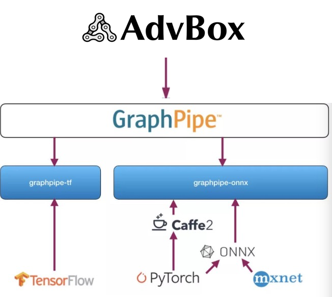

# AdvBox

AdvBox是一款由百度安全实验室研发，在百度大范围使用的AI模型安全工具箱，目前原生支持PaddlePaddle、PyTorch、Caffe2、MxNet、Keras以及TensorFlow平台，方便广大开发者和安全工程师可以使用自己熟悉的框架。

AdvBox同时支持[GraphPipe](https://oracle.github.io/graphpipe),屏蔽了底层使用的深度学习平台，用户可以零编码，仅通过几个命令就可以对PaddlePaddle、PyTorch、Caffe2、MxNet、CNTK、ScikitLearn以及TensorFlow平台生成的模型文件进行黑盒攻击。

AdvBox同时支持白盒、黑盒攻击算法以及主流防御算法，支持列表如下。

## 白盒攻击算法

- L-BFGS
- FGSM
- BIM
- ILCM
- MI-FGSM
- JSMA
- DeepFool
- C/W

## 黑盒攻击算法

- Single Pixel Attack
- Local Search Attack

## 防护算法

- Feature Fqueezing
- Spatial Smoothing
- Label Smoothing
- Gaussian Augmentation
- Adversarial Training
- Thermometer Encoding

对抗样本是深度学习领域的一个重要问题，比如在图像上叠加肉眼难以识别的修改，就可以欺骗主流的深度学习图像模型，产生分类错误，指鹿为马，或者无中生有。这些问题对于特定领域（比如无人车、人脸识别）会产生严重的后果，尤为重要。

百度安全实验室研发了AdvBox，它能够为安全工程师研究模型的安全性提供极大的便利，免去重复造轮子的精力与时间消耗。AdvBox可以高效地使用最新的生成方法构造对抗样本数据集用于对抗样本的特征统计、攻击全新的AI应用，加固业务AI模型，为模型安全性研究和应用提供重要的支持，当前最新版本为[0.4](doc/RELEASE.cn.md)。

# 安装

## 部署AdvBox代码
直接同步advbox的代码，其中示例代码在tutorials目录下。

	git clone https://github.com/baidu/AdvBox.git  

## 初始化软件环境

为了兼容主流的深度学习平台，AdvBox基于python2.7开发，强烈建议使用Conda管理python软件环境，对应的python安装包安装方式如下。

	pip install -r requirements.txt

# 文档

##  新版ebook教程
AdvBox从0.4版开始，支持使用Jupyter Notebook格式的ebook教程，便于用户快速掌握。

| 开发框架 | 数据集 | 被攻击模型 | 攻击算法 | Jupyter Notebook |
| ------ | ------ | ------ | ------ | ------ |
| MxNet | ImageNet2012 | AlexNet | FGSM | [链接](ebook_imagenet_fgsm_mxnet.ipynb) |
| PyTorch | MNIST | CNN/MLP | FGSM | [链接](ebook_mnist_fgsm_pytorch.ipynb) |
| PyTorch | ImageNet2012 | AlexNet | FGSM | [链接](ebook_imagenet_fgsm_pytorch.ipynb) |
| PyTorch | ImageNet2012 | AlexNet | DeepFool | [链接](ebook_imagenet_deepfool_pytorch.ipynb) |
| PyTorch | ImageNet2012 | AlexNet | JSMA | [链接](ebook_imagenet_jsma_pytorch.ipynb) |
| Tensorflow | ImageNet2012 | Inception | FGSM | [链接](ebook_imagenet_fgsm_tf.ipynb) |
| Tensorflow | ImageNet2012 | Inception | DeepFool | [链接](ebook_imagenet_deepfool_tf.ipynb) |
| Tensorflow | ImageNet2012 | Inception | JSMA | [链接](ebook_imagenet_jsma_tf.ipynb) |

## 零编码黑盒攻击示例

为了最小化学习和使用成本，AdvBox提供了零编码黑盒攻击工具。以Tensorflow为例，Tensorflow提供了丰富[预训练模型](https://github.com/tensorflow/models)，假设攻击常见的图像分类模型squeezenet。
首先在docker环境下启动基于GraphPipe的预测服务，GraphPipe环境已经完全封装在docker镜像，不用单独安装。

	docker run -it --rm \
	      -e https_proxy=${https_proxy} \
	      -p 9000:9000 \
	      sleepsonthefloor/graphpipe-tf:cpu \
	      --model=https://oracle.github.io/graphpipe/models/squeezenet.pb \
	      --listen=0.0.0.0:9000

如果网速有限，可以先把squeezenet.pb下载，使用本地模式启动。

	docker run -it --rm \
	      -e https_proxy=${https_proxy} \
	      -v "$PWD:/models/"  \
	      -p 9000:9000 \
	      sleepsonthefloor/graphpipe-tf:cpu \
	      --model=/models/squeezenet.pb \
	      --listen=0.0.0.0:9000

然后启动攻击脚本，使用默认参数即可，仅需指定攻击的url。目前提供的黑盒攻击算法为LocalSearch。

	python advbox_tools.py -u http://your ip:9000

经过迭代攻击后，展现攻击结果如下图所示，具体运行时间依赖于网速，强烈建议在本机上起docker服务，可以大大提升攻击速度。

	localsearch.py[line:293] INFO try 3 times  selected pixel indices:[ 0 23 24 25 26]
	localsearch.py[line:308] INFO adv_label=504 adv_label_pro=0.00148941285443
	localsearch.py[line:293] INFO try 4 times  selected pixel indices:[ 0 22 23 24 25]
	localsearch.py[line:308] INFO adv_label=463 adv_label_pro=0.00127408828121
	attack success, original_label=504, adversarial_label=463
	Save file :adversary_image.jpg
	LocalSearchAttack attack done. Cost time 100.435777187s

以[ONNX](https://onnx.ai/)为例，目前PaddlePaddle、PyTorch、Caffe2、MxNet、CNTK、ScikitLearn均支持把模型保存成ONNX格式。对于ONNX格式的文件，使用类似的命令启动docker环境即可。

	docker run -it --rm \
	      -e https_proxy=${https_proxy} \
	      -p 9000:9000 \
	      sleepsonthefloor/graphpipe-onnx:cpu \
	      --value-inputs=https://oracle.github.io/graphpipe/models/squeezenet.value_inputs.json \
	      --model=https://oracle.github.io/graphpipe/models/squeezenet.onnx \
	      --listen=0.0.0.0:9000

advbox\_tools.py提供了丰富的配置参数，其中LocalSearch算法相关参数的设置可以参考[论文](paper/blackBoxAttack/Simple%20Black-Box%20Adversarial%20Perturbations%20for%20Deep%20Networks.pdf)

	Usage: advbox_tools.py [options]	
	Options:
	  -h, --help            show this help message and exit
	  -u URL, --url=URL     graphpipe url [default: http://127.0.0.1:9000]
	  -m M, --model=M       Deep learning frame [default: onnx] ;must be in
	                        [onnx,tersorflow]
	  -R R, --rounds=R      An upper bound on the number of iterations [default:
	                        200]
	  -p P, --p-parameter=P
	                        Perturbation parameter that controls the pixel
	                        sensitivity estimation [default: 0.3]
	  -r R, --r-parameter=R
	                        Perturbation parameter that controls the cyclic
	                        perturbation;must be in [0, 2]
	  -d D, --d-parameter=D
	                        The half side length of the neighborhood square
	                        [default: 5]
	  -t T, --t-parameter=T
	                        The number of pixels perturbed at each round [default:
	                        5]
	  -i INPUT_FILE, --input-file=INPUT_FILE
	                        Original image file [default: mug227.png]
	  -o OUTPUT_FILE, --output-file=OUTPUT_FILE
	                        Adversary image file [default: adversary_image.jpg]
	  -c C, --channel_axis=C
	                        Channel_axis [default: 0] ;must be in 0,1,2,3

## Keras示例

以Keras环境为例，代码路径为[tutorials/keras_demo.py](tutorials/keras_demo.py)

使用Keras自带的ResNet50模型进行白盒攻击，并设置为预测模式，加载测试图片。

	#设置为测试模式
    keras.backend.set_learning_phase(0)
    model = ResNet50(weights=modulename)
    img = image.load_img(imagename, target_size=(224, 224))
    original_image = image.img_to_array(img)
    imagedata = np.expand_dims(original_image, axis=0)

获取ResNet50的logit层，并创建keras对象。keras的ResNet50要求对原始图像文件进行标准化处理，mean值为[104, 116, 123]，std为1.

	#获取logit层
    logits=model.get_layer('fc1000').output
    # 创建keras对象
    # imagenet数据集归一化时 标准差为1  mean为[104, 116, 123]
    m = KerasModel(
        model,
        model.input,
        None,
        logits,
        None,
        bounds=(0, 255),
        channel_axis=3,
        preprocess=([104, 116, 123],1),
        featurefqueezing_bit_depth=8)

创建攻击对象，攻击算法使用FGSM的non-targeted attack，攻击步长epsilons设置为静态值。
	
	attack = FGSM(m)
	#静态epsilon
	attack_config = {"epsilons": 1, "epsilons_max": 10, "epsilon_steps": 1, "steps": 100}
	# fgsm non-targeted attack
	adversary = attack(adversary, **attack_config)

对比生成的对抗样本和原始图像的差别。
	
	adversary_image=np.copy(adversary.adversarial_example)
	#强制类型转换 之前是float 现在要转换成uint8
	#BGR -> RGB
	adversary_image=adversary_image[:,:,::-1]
	adversary_image = np.array(adversary_image).reshape([224,224,3])
	original_image=np.array(original_image).reshape([224, 224, 3])
	show_images_diff(original_image,adversary_image)

实际运行代码，原始图像和对抗样本的差别如下图所示。

   

## PaddlePaddle示例
请见[PaddlePaddle示例](paddle.md)

##  原有学习教程

为了进一步降低学习成本，AdvBox提供大量的[学习教程](tutorials/README.md)。

 - [示例1：白盒攻击基于MNIST数据集的CNN模型](tutorials/README.md)
 - [示例2：白盒攻击基于CIFAR10数据集的ResNet模型](tutorials/README.md)
 - [示例3：白盒攻击caffe下基于MNIST数据集的LeNet模型](tutorials/README.md)
 - [示例4：黑盒攻击基于MNIST数据集的CNN模型](tutorials/README.md)
 - [示例5：使用FeatureFqueezing加固基于MNIST数据集的CNN模型](tutorials/README.md)
 - [示例6：使用GaussianAugmentation加固基于MNIST数据集的CNN模型](tutorials/README.md)
 - [示例7：白盒攻击PyTorch下基于MNIST数据集的CNN模型](tutorials/README.md)
 - [示例8：白盒攻击PyTorch下基于IMAGENET数据集的AlexNet模型](tutorials/README.md)
 - [示例9：白盒攻击MxNet下基于IMAGENET数据集的AlexNet模型](tutorials/README.md)
 - [示例10：黑盒攻击graphpipe下的基于tensorflow的squeezenet模型](tutorials/README.md)
 - [示例11：黑盒攻击graphpipe下的基于onnx的squeezenet模型](tutorials/README.md)

## 典型应用

基于AdvBox可以针对大量实际使用的AI模型生成对抗样本并给出通用加固方案。

 - [应用1：白盒攻击人脸识别系统](applications/face_recognition_attack/README.md)

# 问题反馈
	
目前支持通过Github提交[issues](https://github.com/baidu/AdvBox/issues)

# 许可

AdvBox循序[Apache License 2.0](https://github.com/baidu/AdvBox/blob/master/LICENSE)

# 作者

- 百度安全实验室 xlab

# 参考文献

- http://www.paddlepaddle.org/docs/develop/documentation/en/build_and_install/pip_install_en.html
- http://paddlepaddle.org/docs/0.14.0/documentation/fluid/zh/new_docs/beginners_guide/install/install_doc.html
- https://github.com/PaddlePaddle/models/tree/develop/fluid/adversarial
- [Intriguing properties of neural networks](https://arxiv.org/abs/1312.6199), C. Szegedy et al., arxiv 2014
- [Explaining and Harnessing Adversarial Examples](https://arxiv.org/abs/1412.6572), I. Goodfellow et al., ICLR 2015
- [Adversarial Examples In The Physical World](https://arxiv.org/pdf/1607.02533v3.pdf), A. Kurakin et al., ICLR workshop 2017
- [Boosting Adversarial Attacks with Momentum](https://arxiv.org/abs/1710.06081), Yinpeng Dong et al., arxiv 2018
- [The Limitations of Deep Learning in Adversarial Settings](https://arxiv.org/abs/1511.07528), N. Papernot et al., ESSP 2016
- [DeepFool: a simple and accurate method to fool deep neural networks](https://arxiv.org/abs/1511.04599), S. Moosavi-Dezfooli et al., CVPR 2016
- [Foolbox: A Python toolbox to benchmark the robustness of machine learning models](https://arxiv.org/abs/1707.04131), Jonas Rauber et al., arxiv 2018
- [CleverHans: An adversarial example library for constructing attacks, building defenses, and benchmarking both](https://github.com/tensorflow/cleverhans#setting-up-cleverhans)
- [Threat of Adversarial Attacks on Deep Learning in Computer Vision: A Survey](https://arxiv.org/abs/1801.00553), Naveed Akhtar, Ajmal Mian, arxiv 2018

