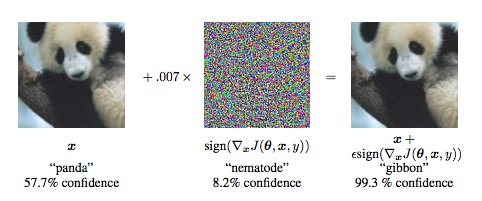
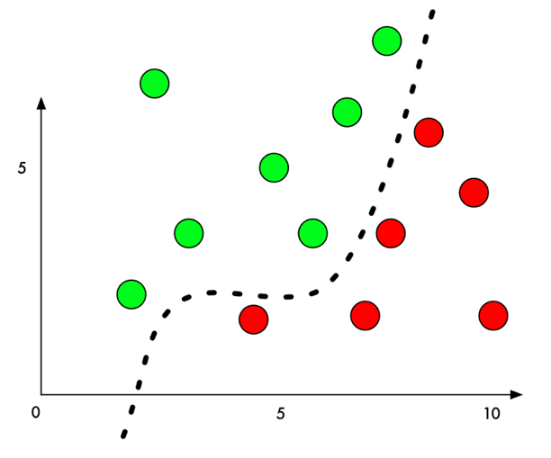

# 项目简介
## 对抗样本简介
对抗样本(Adversarial Example Attack)是机器学习模型的一个有趣现象，攻击者通过在源数据上增加人类难以通过感官辨识到的细微改变，但是却可以让机器学习模型接受并做出错误的分类决定。一个典型的场景就是图像分类模型的对抗样本，通过在图片上叠加精心构造的变化量，在肉眼难以察觉的情况下，让分类模型产生误判。

以经典的二分类问题为例，机器学习模型通过在样本上训练，学习出一个分割平面，在分割平面的一侧的点都被识别为类别一，在分割平面的另外一侧的点都被识别为类别二。

生成对抗样本时，我们通过某种算法，针对指定的样本计算出一个变化量，该样本经过修改后，从人类的感觉无法辨识，但是却可以让该样本跨越分割平面，导致机器学习模型的判定结果改变。

如何高效的生成对抗样本，且让人类感官难以察觉，正是对抗样本生成算法研究领域的热点。
## AdvBox简介

AdvBox是一款支持PaddlePaddle、Caffe2以及TensorFlow的针对深度学习模型生成对抗样本的工具包。对抗样本是深度学习领域的一个重要问题，比如在图像上叠加肉眼难以识别的修改，就可以欺骗主流的深度学习图像模型，产生分类错误，指鹿为马，或者无中生有。对抗样本表现出来的显著反直观特点吸引了越来越多的研究者进入对抗样本检测、生成与防御研究领域。这些问题对于特定领域（比如无人车、人脸识别）会产生严重的后果，尤为重要。TensorFlow平台上也推出了相应的工具包CleverHans。为此，百度安全实验室研发了AdvBox，它能够为研究者在PaddlePaddle平台上研究模型安全性提供极大的便利，免去重复造轮子的精力与时间消耗，可以高效地使用最新的生成方法构造对抗样本数据集用于对抗样本的特征统计、攻击全新的AI应用，加固业务AI模型，为模型安全性研究和应用提供重要的支持。之前AdvBox作为PaddlePaddle开源项目的一个模块，获得了广泛好评。这次因为项目发展的需要，特此作为独立项目开源。当前最新版本为[v0.2](doc/RELEASE.cn.md)。
目前AdvBox支持的算法包含以下几种：

- L-BFGS
- FGSM
- BIM
- ILCM
- MI-FGSM
- JSMA
- DeepFool
- C/W

为了进一步降低学习成本，AdvBox从v0.2版本开始持续丰富[使用示例](tutorials/README.md)。
## AdvBox特点
### 多平台支持
原生支持PaddlePaddle平台，同时提供了专门的工具，将Caffe以及TensorFlow平台生成的模型转换成PaddlePaddle识别的格式，从而实现了对Caffe以及TensorFlow平台的支持。
### 支持多种算法
支持常见的对抗样本生成算法，包括但不不限于L-BFGS、FGSM、BIM、ILCM、MI-FGSM、JSMA、 DeepFool和C/W等。
### 支持多种攻击模式
支持生成untargeted或targeted对抗样本。
### 自动优化攻击速率
支持手工指定以及自动调节eps，兼顾攻击成功率和对抗样本生成速度。
### 支持自定义算法
架构开放，可扩展性强，便于AI安全研究人员开发、调试新的攻击算法。

# 安装AdvBox
## 安装paddlepaddle
### 创建paddlepaddle环境
通常使用anaconda创建不同的python环境，解决python多版本不兼容的问题。目前advbox仅支持python 2.*, paddlepaddle 0.12以上。

	conda create --name pp python=2.7
	
通过下列命令激活paddlepaddle环境	
	
	source activate pp
	
如果没有安装anaconda，可以通过下载安装脚本并执行。

	wget https://repo.anaconda.com/archive/Anaconda2-5.2.0-Linux-x86_64.sh
	
### 安装paddlepaddle包
最简化的安装可以直接使用pip工具。

	pip install paddlepaddle

如果有特殊需求希望指定版本进行安装，可以使用参数。

	pip install paddlepaddle==0.12.0

如果希望使用GPU加速训练过程，可以安装GPU版本。

	pip install paddlepaddle-gpu

需要特别指出的是，paddlepaddle-gpu针对不同的cuDNN和CUDA具有不同的编译版本。一百度云上的GPU服务器为例，CUDA为8.0.61，cuDNN为5.0.21，对应的编译版本为paddlepaddle-gpu为paddlepaddle-gpu==0.14.0.post85。

	pip install paddlepaddle-gpu==0.14.0.post85

查看服务器的cuDNN和CUDA版本的方法为：

	#cuda 版本
	cat /usr/local/cuda/version.txt
	#cudnn 版本 
	cat /usr/local/cuda/include/cudnn.h | grep CUDNN_MAJOR -A 2
	#或者
	cat /usr/include/cudnn.h | grep CUDNN_MAJOR -A 2

详细支持列表可以参考链接。

	http://paddlepaddle.org/docs/0.14.0/documentation/fluid/zh/new_docs/beginners_guide/install/install_doc.html

## mac下安装paddlepaddle包
mac下安装paddlepaddle包方式比较特殊，相当于在docker镜像直接运行。

	docker pull paddlepaddle/paddle
	docker run --name paddle-test -v $PWD:/paddle --network=host -it paddlepaddle/paddle /bin/bash

如果mac上没有装docker，需要提前下载并安装。

	https://download.docker.com/mac/stable/Docker.dmg
	
## 多GPU支持
部分场景需要使用多GPU加速，这个时候需要安装nccl2库，对应的下载地址为：

	https://developer.nvidia.com/nccl/nccl-download

下载对应的版本，以百度云为例，需要下载安装NCCL 2.2.13 for Ubuntu 16.04 and CUDA 8。下载完毕后，进行安装。

	apt-get install libnccl2=2.2.13-1+cuda8.0 libnccl-dev=2.2.13-1+cuda8.0
	
设置环境变量。

	export NCCL_P2P_DISABLE=1  
	export NCCL_IB_DISABLE=1

## 部署AdvBox代码
直接同步advbox的代码。

	git clone https://github.com/baidu/AdvBox.git        

advbox的目录结果如下所示，其中示例代码在tutorials目录下。

	.
	├── advbox
	|   ├── __init__.py
	|   ├── attack
	|        ├── __init__.py
	|        ├── base.py
	|        ├── deepfool.py
	|        ├── gradient_method.py
	|        ├── lbfgs.py
	|        └── saliency.py
	|   ├── models
	|        ├── __init__.py
	|        ├── base.py
	|        └── paddle.py
	|   └── adversary.py
	├── tutorials
	|   ├── __init__.py
	|   ├── mnist_model.py
	|   ├── mnist_tutorial_lbfgs.py
	|   ├── mnist_tutorial_fgsm.py
	|   ├── mnist_tutorial_bim.py
	|   ├── mnist_tutorial_ilcm.py
	|   ├── mnist_tutorial_mifgsm.py
	|   ├── mnist_tutorial_jsma.py
	|   └── mnist_tutorial_deepfool.py
	└── README.md

## 对Caffe以及TensorFlow平台的支持
### 如何将Caffe平台的模型转换成PaddlePaddle格式
提供了转换工具[caffe2paddle](https://github.com/PaddlePaddle/models/tree/develop/image_classification/caffe2paddle)，使用方法如下：

	https://github.com/PaddlePaddle/models/tree/develop/image_classification/caffe2paddle

### 如何将TensorFlow平台的模型转换成PaddlePaddle格式
提供了转换工具[tf2paddle](https://github.com/PaddlePaddle/models/tree/develop/image_classification/tf2paddle)，使用方法如下：

	https://github.com/PaddlePaddle/models/tree/develop/image_classification/tf2paddle

## hello world
安装完advbox后，可以运行自带的hello world示例代码。
### 生成测试模型
首先需要生成攻击用的模型，advbox的测试模型是一个识别mnist的cnn模型。

	cd tutorials/
	python mnist_model.py

运行完模型后，会将模型的参数保留在当前目录的mnist目录下。查看该目录，可以看到对应的cnn模型的每层的参数，可见有两个卷积层和两个全连接层构成。

	conv2d_0.b_0  
	conv2d_0.w_0  
	conv2d_1.b_0  
	conv2d_1.w_0  
	fc_0.b_0  
	fc_0.w_0  
	fc_1.b_0  
	fc_1.w_0

### 运行攻击代码
这里我们运行下基于FGSM算法的演示代码。

	python mnist_tutorial_fgsm.py

运行攻击脚本，对mnist数据集进行攻击，测试样本数量为500，其中攻击成功394个，占78.8%。

	attack success, original_label=4, adversarial_label=9, count=498
	attack success, original_label=8, adversarial_label=3, count=499
	attack success, original_label=6, adversarial_label=1, count=500
	[TEST_DATASET]: fooling_count=394, total_count=500, fooling_rate=0.788000
	fgsm attack done

# 参考文献

- http://www.paddlepaddle.org/docs/develop/documentation/en/build_and_install/pip_install_en.html
- http://paddlepaddle.org/docs/0.14.0/documentation/fluid/zh/new_docs/beginners_guide/install/install_doc.html
- https://github.com/PaddlePaddle/models/tree/develop/fluid/adversarial
- [Intriguing properties of neural networks](https://arxiv.org/abs/1312.6199), C. Szegedy et al., arxiv 2014
- [Explaining and Harnessing Adversarial Examples](https://arxiv.org/abs/1412.6572), I. Goodfellow et al., ICLR 2015
- [Adversarial Examples In The Physical World](https://arxiv.org/pdf/1607.02533v3.pdf), A. Kurakin et al., ICLR workshop 2017
- [Boosting Adversarial Attacks with Momentum](https://arxiv.org/abs/1710.06081), Yinpeng Dong et al., arxiv 2018
- [The Limitations of Deep Learning in Adversarial Settings](https://arxiv.org/abs/1511.07528), N. Papernot et al., ESSP 2016
- [DeepFool: a simple and accurate method to fool deep neural networks](https://arxiv.org/abs/1511.04599), S. Moosavi-Dezfooli et al., CVPR 2016
- [Foolbox: A Python toolbox to benchmark the robustness of machine learning models](https://arxiv.org/abs/1707.04131), Jonas Rauber et al., arxiv 2018
- [CleverHans: An adversarial example library for constructing attacks, building defenses, and benchmarking both](https://github.com/tensorflow/cleverhans#setting-up-cleverhans)
- [Threat of Adversarial Attacks on Deep Learning in Computer Vision: A Survey](https://arxiv.org/abs/1801.00553), Naveed Akhtar, Ajmal Mian, arxiv 2018

